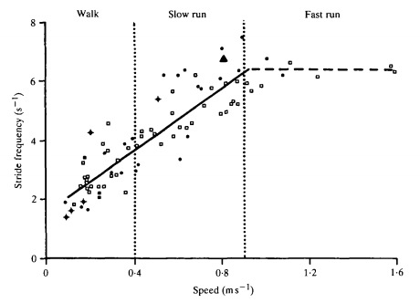
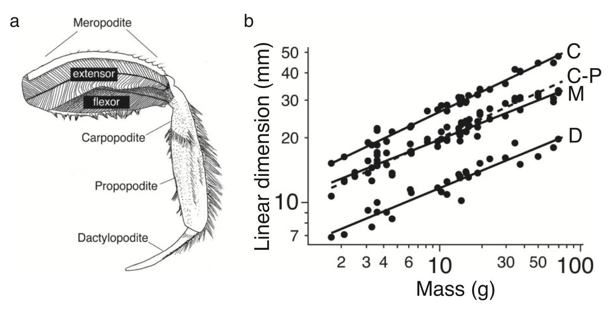
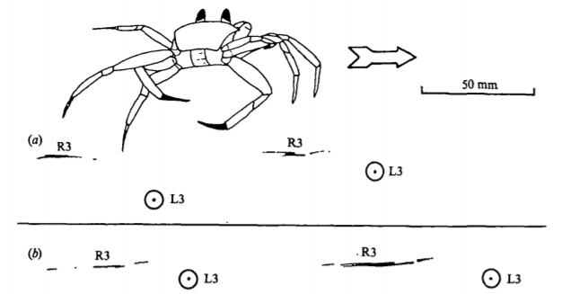
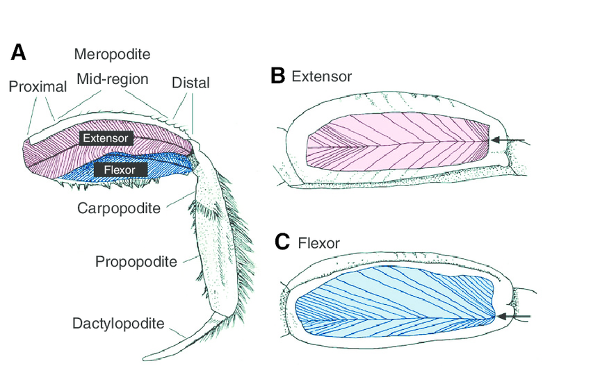
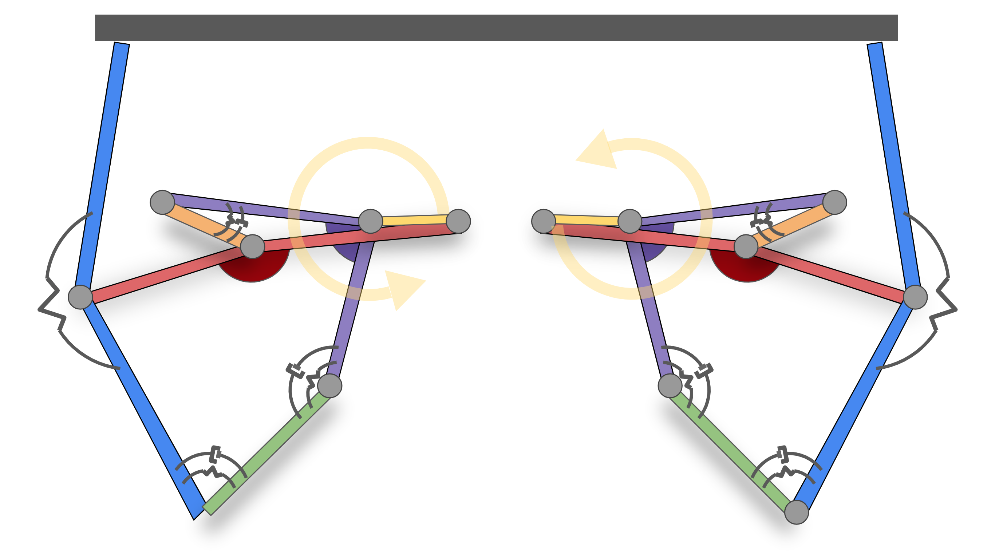
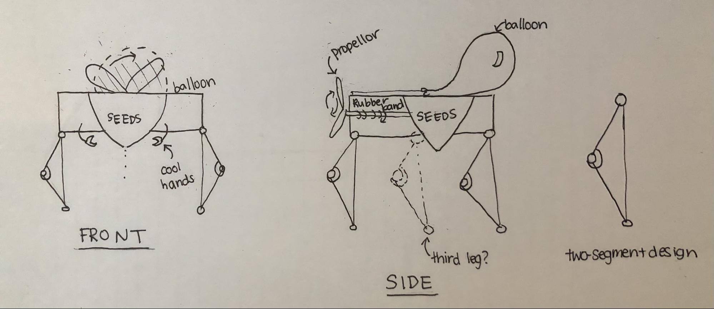
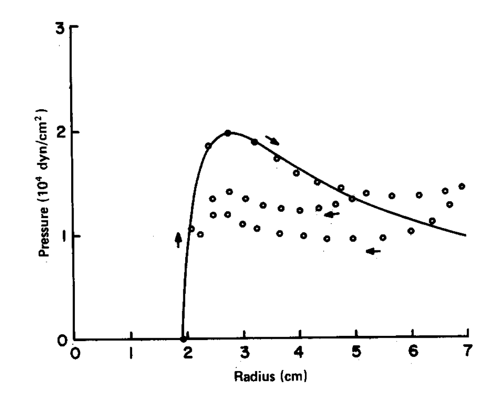

# Biomechanics Background and Initial Specifications

## Steps of the Procedure

### Step 1: Candidate Organism

_Identify a candidate organism you wish to focus on its biomechanics. This consists of a specific animal species, its body plan, and the motion of interest. Search in Google scholar, using keywords such as “anatomy,” “morphology,” “mechanics,” “biomechanics,” “ground reaction forces,” etc. along with the animal’s informal or scientific name along with the type of locomotion._

We have selected the ghost crab (Ocypode quadrata) as our candidate organism. We believe this animal is of an appropriate size and would be suitable for our single leg mechanism.

*   _List five of the most closely related research references on topics pertinent to your project, in IEEE format._

\* [1] S. B. Whittemore, B. Hoglin, M. A. Green, and S. Medler. “Stride Frequency in Relation to Allometric Growth in Ghost Crabs: Stride Frequency in Ghost Crabs.” _Journal of Zoology_ (1987), vol. 296, no. 4, Aug. 2015, pp. 286–94, [doi:10.1111/jzo.12244](https://zslpublications-onlinelibrary-wiley-com.ezproxy1.lib.asu.edu/doi/pdfdirect/10.1111/jzo.12244).

[2] R. Blickhan and R. J. Full, “Locomotion Energetics of the Ghost Crab: II. Mechanics of the Centre of Mass During Walking and Running,” _Journal of Experimental Biology_, vol. 130, no. 1, pp. 155–174, Jul. 1987. Retrieved from [ https://jeb.biologists.org/content/jexbio/130/1/155.full.pdf](https://jeb.biologists.org/content/jexbio/130/1/155.full.pdf)

\* [3] Springthorpe, D. (2016). Biomechanical Multifunctionality in the Ghost Crab, Ocypode quadrata. _UC Berkeley_. ProQuest ID: Springthorpe_berkeley_0028E_16586. Merritt ID: ark:/13030/m54z06hg. Retrieved from [https://escholarship.org/uc/item/1kh6b90z](https://escholarship.org/uc/item/1kh6b90z) 

\* [4] R. J. Full, R. B. Weinstein, Integrating the Physiology, Mechanics and Behavior of Rapid Running Ghost Crabs: Slow and Steady Doesn't Always Win the Race, _American Zoologist_, Volume 32, Issue 3, June 1992, Pages 382–395, [https://doi.org/10.1093/icb/32.3.382](https://doi.org/10.1093/icb/32.3.382) 

[5] M. J. Perry, J. Tait, J. Hu, S. C. White, and S. Medler, “Skeletal muscle fiber types in the ghost crab, Ocypode quadrata: implications for running performance,” _Journal of Experimental Biology_, vol. 212, no. 5, pp. 673–683, Mar. 2009, doi:[ 10.1242/jeb.023481](https://doi.org/10.1242/jeb.023481).

*   _Identify three citations which are most useful in creating initial specifications for your robot (use an asterisk in the previous list). Now discuss these three papers, highlighting the information you can draw from each. Be specific. Why is each paper valuable? (At least one paragraph each)_

In [1] the authors investigate how the mechanical properties of ghost crabs change as they grow. At different stages in a ghost crab’s development, the stride frequency of the crab changes. The authors attribute this change throughout a crab’s growth to changes in the contractile properties of skeletal muscles. Because of the authors’ focus on the mechanical properties of ghost crabs throughout their development, much of the research is based on the idea how the body size of an animal affects its locomotion, and this concept is very important for our group when creating our initial specifications.

The reason the authors chose to investigate the ghost crab is because they “grow in size by orders of magnitude over their lifetime” so are a good candidate organism for investing how changes in body size affect its locomotion [1]. The authors ran treadmill experiments on 24 ghost crabs that greatly varied in size, from 2.5 to 65 g. Using the data within this range of sizes will help our group identify the best properties to promote locomotion given the size and weight of the materials that we use. This paper also goes into detail of many different aspects of the locomotion that they identified during their treadmill study, such as that the “angular velocity during extension was 15% faster than during flexion.” The paper also mentioned that most of the locomotion is driven by the crab pushing itself along (rather than using a combination of pushing and pulling).

[3] studies the biomechanical multifunctionality of the ghost crab, or the ability of the ghost crab to use its limbs for multiple different tasks. “[T]hey can accomplish a wide range of behaviors including running, burrowing, climbing and dexterous manipulation” with the same set of limbs. This paper is valuable as it has an in depth study of the mechanisms of the ghost crab using a multitude of techniques including x-ray and mathematical models. This is valuable as it provides multiple perspectives on how the mechanisms of locomotion for the ghost crab works. This paper was able to discover movement techniques that the ghost crab uses to move over obstacles. This is extremely useful as it gives bio inspired designers an idea of what mechanics are important for designing a similar system.

In [4] the authors discuss the integration of the physiology and mechanics of running Ghost Crabs. They found that their findings supported the hypothesis that, “terrestrial locomotion in many species can be modeled by an inverted pendulum or spring-mass system” [4]. The authors were able to focus on the walking, trotting, and galloping of Ghost Crabs, as well as what powers the locomotion of the crabs. They describe the different types of locomotion and its effects on the crabs. Their pendulum like movements and speeds will help our group gain more inspiration for the mechanisms for our robot. The authors research will be useful to our group in creating our initial specifications because of the studies and data depicted by their models.

---

### Step 2: Bio-inspired Robots

_Search for existing bio-inspired robots based on the same animal, subsystem, and motion._

*   _List five of the most closely-related research references on topics pertinent to your project in IEEE format._

\* [6] B. L. Luk, S. Galt, and S. Chen “Using Genetic Algorithms to Establish Efficient Walking Gaits for an Eight-Legged Robot.” _International Journal of Systems Science_, vol. 32, no. 6, Taylor & Francis Group, Jan. 2001, pp. 703–13, [doi:10.1080/00207720117230](https://www-tandfonline-com.ezproxy1.lib.asu.edu/doi/pdf/10.1080/00207720117230?needAccess=true).

\* [7] J. C. Spagna, D. I. Goldman, P.-C. Lin, D. E. Koditschek, and R. J. Full, “Distributed mechanical feedback in arthropods and robots simplifies control of rapid running on challenging terrain,” _Bioinspiration & Biomimetics_, vol. 2, no. 1, Jan. 2001, pp. 9-18, [doi:10.1088/1748-3182/2/1/002](https://iopscience.iop.org/article/10.1088/1748-3182/2/1/002/pdf)

[8] K. Karydis, I. Poulakakis and H. G. Tanner, "A switching kinematic model for an octapedal robot," 2012 IEEE/RSJ International Conference on Intelligent Robots and Systems, Vilamoura, 2012, pp. 507-512, doi:10.1109/IROS.2012.6386230. 

\* [9] K. Karydis, Y. Liu, I. Poulakakis, and H. G. Tanner, “A Template for Miniature Legged Robots in Quasi-Static Motion,” p. 15.

[10] F. Qian, T. Zhang,  W. Korff,  P.B. Umbanhowar, R.J Full, and D.I. Goldman. “Principles of appendage design in robots and animals determining terradynamic performance on flowable ground.” _Bioinspiration & biomimetics_, 10(5), 2015., p.056014.

*   _Identify three citations which are most useful in creating initial specifications for your robot(use an asterisk in the previous list). Now discuss these three papers, highlighting the information you can draw from each. Be specific. Why is each paper valuable? (At least one paragraph each)_

In [6], the authors investigate how to find efficient walking strategies for an 8-legged robot. They use a genetic algorithm as a method of “natural evolution emulation” since their goal is to identify the best way for their robot to walk. Therefore, the most efficient locomotion for their robot is not directly bio-inspired from a ghost crab, but instead, their bio-inspiration comes from the method which they use to explore the design space of different possible locomotion strategies. They also consider the case when one of their robot’s legs is not functional, so they can see how the robot’s gait is optimized in this case. One important point that the authors make is that the stability of the system can be increased due to the redundancy in the number of legs. The final conclusion that the authors make is that the locomotion of the robot after optimizing different methods with a genetic algorithm is “very similar to that evolved by the ghost crab.” So while this paper does not directly provide any specifications of the mechanical hardware, it is valuable because it demonstrates the ability of a robot to match the gait of the ghost crab.

In [7], the paper describes how the authors investigated the distributed mechanical feedback in arthropods and robots. They simplified the control of rapid running on challenging terrain. They found that “slow, precise stepping using distributed neural feedback” was one way for dealing with challenging terrain. Arthropods, however, simplify their control on difficult surfaces by quickly running using kinetic energy to bridge gaps between footholds [2]. This paper would be valuable for our group because the paper’s discussion around Ghost crabs, tells us how the crabs showed increased mobility on wire mesh after the addition of artificial collapsible spines. Also, their bio-inspired robot was redesigned for maximizing effective leg contact by changing leg orientation and adding directional spines, which can be useful for our own design [2]. 

Inspired by the ghost crab, [9] creates a template for 6-legged robots that can be followed for similar designs. The multi-legged robot has advantages due to its ability to easily traverse difficult terrain. This is valuable to our group as it gives a template to start from in the design of our own robot that is inspired by the ghost crab. Since there has been plenty of research on the ghost crab, it is important that the group is able to start from the forefront of this research when developing our own design. The design they came up with is a switching four-bar mechanism that features “ a low-complexity kinematic model able that captures the horizontal-plane behavior of small legged robots”. The simulation techniques used allowed them to create a relationship between the robot’s inputs to the desired model inputs. This allows the designer to compute motor gains to do “three types of motion primitives comprising straight-line paths, clockwise and counter-clockwise turns”. 

---

### Step 3: Specifications

_Collect all the information you have found from your references into one place. A well-formatted table may do, with supplementary figures from literature as needed. A specifications table is a handy way to collect parameters. Use SI units._

**Table I.** Ghost Crab Biomechanics Specifications

<table>
  <tr>
   <td><strong>Parameter</strong>
   </td>
   <td><strong>Unit</strong>
   </td>
   <td><strong>Value Range</strong>
   </td>
   <td><strong>Reference</strong>
   </td>
  </tr>
  <tr>
   <td>Large crab stride frequency
   </td>
   <td>Hz
   </td>
   <td>5
   </td>
   <td>[1]
   </td>
  </tr>
  <tr>
   <td>Large crab weight
   </td>
   <td>g
   </td>
   <td>75
   </td>
   <td>[1]
   </td>
  </tr>
  <tr>
   <td>Large crab top speed
   </td>
   <td>m/s
   </td>
   <td>1
   </td>
   <td>[1]
   </td>
  </tr>
  <tr>
   <td>Small crab stride frequency
   </td>
   <td>Hz
   </td>
   <td>10
   </td>
   <td>[1]
   </td>
  </tr>
  <tr>
   <td>Small crab weight
   </td>
   <td>g
   </td>
   <td>&lt;30
   </td>
   <td>[1]
   </td>
  </tr>
  <tr>
   <td>Stride frequency given crab mass in g
   </td>
   <td>Hz
   </td>
   <td>12.6 × mass−0.14
   </td>
   <td>[1]
   </td>
  </tr>
  <tr>
   <td>Carapace length given crab mass in g
   </td>
   <td>mm
   </td>
   <td>12.9 × mass0.31
   </td>
   <td>[1]
   </td>
  </tr>
  <tr>
   <td>Meropodite length given crab mass in g
   </td>
   <td>mm
   </td>
   <td>0.7 × mass0.26
   </td>
   <td>[1]
   </td>
  </tr>
  <tr>
   <td>Carpopodite‐propopodite length given crab mass in g
   </td>
   <td>mm
   </td>
   <td>10.0 × mass0.30
   </td>
   <td>[1]
   </td>
  </tr>
  <tr>
   <td>Dactyl length given crab mass in g
   </td>
   <td>mm
   </td>
   <td>6.3 × mass0.27
   </td>
   <td>[1]
   </td>
  </tr>
  <tr>
   <td>Meropodite cross‐sectional area given crab mass in g
   </td>
   <td>mm2
   </td>
   <td>16.2 × mass0.58
   </td>
   <td>[1]
   </td>
  </tr>
  <tr>
   <td>Mean angular excursion of leading legs
   </td>
   <td>degrees
   </td>
   <td>81.5 ± 2.6
   </td>
   <td>[1]
   </td>
  </tr>
  <tr>
   <td>Mean angular excursion of trailing legs
   </td>
   <td>degrees
   </td>
   <td>91.7 ± 2.1.9
   </td>
   <td>[1]
   </td>
  </tr>
  <tr>
   <td>Mass-specific rate of mechanical power required to lift and accelerate the center of mass (with velocity in m/s)
   </td>
   <td>W/(g×s)
   </td>
   <td>0.95 × velocity + 0.03
   </td>
   <td>[2]
   </td>
  </tr>
  <tr>
   <td>Average Force During Walking of Leading Legs While Decelerating
   </td>
   <td>N/kg
   </td>
   <td>-0.28 ± 0.18
   </td>
   <td>[2]
   </td>
  </tr>
  <tr>
   <td>Average Force During Walking of Trailing Legs While Accelerating
   </td>
   <td>N/kg
   </td>
   <td>0.27 ± 0.13
   </td>
   <td>[2]
   </td>
  </tr>
  <tr>
   <td>Average Force During Running of Trailing Legs while Accelerating
   </td>
   <td>N/kg
   </td>
   <td>3.12 ± 0.26
   </td>
   <td>[2]
   </td>
  </tr>
  <tr>
   <td>Average Force During Running of Leading Legs while Decelerating
   </td>
   <td>N/kg
   </td>
   <td>-0.86 ± 0.14
   </td>
   <td>[2]
   </td>
  </tr>
</table>

Fig. 1. Stride frequency of the ghost crab as speed increases. [2] Vertical lines are used to indicate when the crab changes its gait.

---

### Step 4: Informed Assumptions

_Fill in the information gaps from your biomechanics investigation with informed assumptions you can make. For example, if you know ground reaction forces from your paper, and some masses, try to find peak accelerations. If you know forces and velocities, calculate power usage. If you know maximum jump height and mass, find energy required for a jump. The most important pieces of information you can gather at this point are elements like “how much energy is consumed in accomplishing this gait,” “What are the forces involved,” etc._

The force when running with the leading legs can be easily calculated by considering the mass of a large crab and inputting the given acceleration from the Table I above:

F=ma =>F=0.075kg*3.12N/kg=0.234N

The amount of energy required by the crab’s gait is not easy to find analytically, since there is significant energy transfer between the crab and the environment, and within the crab itself: “Potential energy is converted to kinetic energy as the animal's body falls forward over stiffened legs” [5]. However, from [2], the equation for the mass-specific rate of mechanical power required to lift and accelerate the centre of mass (with velocity in m/s) was found experimentally to be 0.95 × velocity + 0.03 and is in units of W/(g×s) since it is a rate of power range per gram of weight of the crab. Therefore, for a large crab weighing 75g (from [1]) moving at 1 m/s, this quantity will be 0.97 W/(g×s). That means for the crab to accelerate and support its weight for 1 second, it will require 0.97W/(g×s) × (75g×1s) = 72.7W of power. This is a bit higher than the power required to light an incandescent light bulb (60W). It is unlikely that the crab robot we design will weigh 75g, given that we plan to use paper for the joints and links, a balloon and turbine for propulsion, and the robot will carry some number of seeds. However, since we have not yet designed the robot, we do not have a good estimate of what the final weight of the robot will be. The equation from [2] will be useful for getting an estimate of the power required by our robot during acceleration.

---

### Step 5: Figures from Literature

_Supply at least two figures from literature, highlighting key aspects of the biological system. This should include one from each of the following categories:_

*   _Figures/drawings of skeleton, anatomy, exoskeleton, body plan, musculature, kinematics_
*   _Motion plots, freeze frames of gait cycle, plot of ground reaction forces_
*   _… other aspects of the parameters above._

Fig. 2. Plot from [1]. On the left, a drawing of the anatomical structure of a single crab leg. On the right, a plot of how the mass of crab correlates with the linear dimension of the legs.

Fig 3. This figure shows the impressions of the legs when the crab is quickly running. The smear marks, indicated by R3, are due to the crab’s legs dragging to help with its balance. The dots indicated by L3 were from the crab’s legs stepping in a precise spot without dragging. [4]

Fig 4. From [5], a diagram of the anatomy of a single crab lab, including the main muscles used for actuation.

---

### Step 6: Engineering Representation

_Draw the simplest engineering representation of the system you can of your proposed mechanical system. How many rigid bodies are there? How many can be approximated as massless(1/10 of the total mass or less)? Where are the springs? Where is the (main) actuator? _

Note: This response has been updated to reflect our updated research question of designing a compliant leg mechanism. The original response is included below the updated one for context.

Fig. 5A. Simple engineering representation of proposed mechanical system (updated version).

Our proposed system has

Fig. 5B. Simple engineering representation of proposed mechanical system (original version).

Our proposed system has only one rigid body that can not be approximated as massless. Since the goal of our robot is to be biodegradable, we will be using a (biodegradable) balloon and propellor as the means of powering our robot. This will operate as our actuator. We will also have a spring that is represented through the rubber band powered propellor. As the robot moves, seeds will come out the bottom and disperse on the ground.

The team has since refined the research question which additionally changes the design. Due to issues from the creating the above power system, the team shifted focus to just a single leg and making it compliant. The new mechanism will still be biodegradable, however, the refined project will be simpler to achieve in one semester. The team also expanded on the previous research question to focus on the compliance of the biodegradable materials to improve the gait of the mechanism.

## Discussion

### Question 1: Selected Animal Size

_Discuss / defend your rationale for the size animal you selected in terms of your ability to replicate key features remotely with limited material selection._

The team decided to model our device after a ghost crab. With our project being a seed-spreading robot, the device does not need to be overly big. The ghost crab also burrows in the sand, which we can model our device to adapt it for soil. In terms of replicating key features, the crab is a design that we can replicate remotely because it is not overly difficult compared to other animals that could work for our project. We can use household items to replicate the movement of the crab, and find materials that can aid with dispensing the seed onto the ground.

Another benefit of selecting the ghost crab as our candidate organism that we will draw bio-inspiration from is that ghost crabs can vary greatly in size by orders of magnitude [1]. Therefore, previous researchers who have studied the kinematics and energy requirements of ghost crabs often present their findings as functions of the crab’s mass. Therefore, our group can design our robot to be any size within the large range of possible ghost crab sizes and we can still directly use the findings from previous research for considerations such as size of the legs or frequency of the gait.

The team will still be focusing on replicating the movement of the crab, however the focus has shifted to only one leg. The team refined the research question to a compliant crab leg mechanism. The seed spreading device will no longer be used for research.

### Question 2: Torque Generation

_Find a motor and battery that can supply the mechanical power needs obtained above. Consider that motor efficiencies may be as high as 95%, but if you can’t find it listed, assume you find a more affordable motor at 50-70% efficiency. Compare the mechanical watts/kg for the necessary motor and battery vs the animal’s mechanical power/mass above? Which one is more energy dense?_

Due to our design being biodegradable, a motor and battery would be impractical to power the device as they are not easily degradable within a reasonable amount of time. Because of this, another power device must be considered for the purpose of our project. Our original idea of a design includes a turbine being spun by an inflated balloon. The purpose of this balloon is to exert the air pressure from inside the balloon to mechanical spin the turbine, thus powering the machine. In order to do the calculations on how much pressure is needed to power the robot, the energy estimate is used from the ghost crab to help calculate the pressure needed when blowing up the balloon. The calculations for this model are presented here. Once we started working on the dynamics assigment, we switched to just used a wind turbine that is powered by the outside air rather than a balloon.

Analytically calculating the power produced from the release of air from a balloon is very challenging, since it requires knowledge of the surface tension of the balloon’s material, the shape of the balloon as it inflates, and considerations on the flow released from a hole in the balloon. Ideally, we could perform an experiment with a biodegradable balloon and a force plate to determine the force vs time produced from the release of air of the balloon, and how different sized and shaped nozzles impact the output flow. For this assignment, we are able to perform some rough calculations to get an idea of the order of magnitude of the power we can generate through this method. 

In [11], the authors perform an analytical calculation of the pressure curve of a standard, rubber balloon, and verify their calculation through experimentation. The figure below is from the authors’ results.

Fig. 6. Analytical (solid line) and experimental (circles) pressure curve for a rubber balloon presented in [11].

From the figure above, it is clear that there is a good deal of complexity in the analysis of the force produced by the release of air from a rubber balloon. In fact, the paper also includes the effects of hysteresis in the surface of the balloon, which is a result of the material properties of the rubber balloon. Since our group plans to use a biodegradable balloon, it is possible that we will get different results. However, some rough calculations can be made from the figure above. The force of the air coming out of a small nozzle can be estimated by the pressure of the balloon divided by the area of the hole. Of course this ignores many of the fluid mechanics considerations such as the pressure difference between the outside air and the inside of the balloon, but it provides a rough approximation. The maximum pressure of the balloon is found to be 2 dyn/cm2  which is equal to 0.2 Pa. If a 0.5 cm radius hole were cut in the balloon to allow a release of a air, the force generated at this time would be approximately 0.2/(pi*0.5^(2)) or 0.25 N.

Calculating the power produced by a wind turbine being blown by this balloon is also not a simple problem, since it will require a calculation of the efficiency of the turbine and how much of the force generated by the balloon pushes on the blades of the wind turbine. These calculations will require us having defined the turbine blades’ geometry. Another approach that we could take instead of the air from a balloon pushing on the blades of the turbine would be to run the air through the blades to cause rotation, as it used in balloon helicopter toys [12]. Using either approach, there will be a loss of power from the output of the balloon to the legs of the robot, while these will be important quantities to find, we will need to rely on experimentally collected data once we have made a preliminary design since there are too many unknowns right now to perform any reasonable calculations. In the dynamics assignment, we include calculations for the stall torque of our wind turbine mechanism. We found this to not generate enough torque to move the crab robot in a reasonable amount of time, so we will likely need to change our reseasrch question to make the problem more tractable.

---

## Bibliography

[1] S. B. Whittemore, B. Hoglin, M. A. Green, and S. Medler. “Stride Frequency in Relation to Allometric Growth in Ghost Crabs: Stride Frequency in Ghost Crabs.” _Journal of Zoology_ (1987), vol. 296, no. 4, Aug. 2015, pp. 286–94, [doi:10.1111/jzo.12244](https://zslpublications-onlinelibrary-wiley-com.ezproxy1.lib.asu.edu/doi/pdfdirect/10.1111/jzo.12244).

[2] R. Blickhan and R. J. Full, “Locomotion Energetics of the Ghost Crab: II. Mechanics of the Centre of Mass During Walking and Running,” _Journal of Experimental Biology_, vol. 130, no. 1, pp. 155–174, Jul. 1987. Retrieved from [ https://jeb.biologists.org/content/jexbio/130/1/155.full.pdf](https://jeb.biologists.org/content/jexbio/130/1/155.full.pdf)

[3] Springthorpe, D. (2016). Biomechanical Multifunctionality in the Ghost Crab, Ocypode quadrata. _UC Berkeley_. ProQuest ID: Springthorpe_berkeley_0028E_16586. Merritt ID: ark:/13030/m54z06hg. Retrieved from [https://escholarship.org/uc/item/1kh6b90z](https://escholarship.org/uc/item/1kh6b90z) 

[4] R. J. Full, R. B. Weinstein, Integrating the Physiology, Mechanics and Behavior of Rapid Running Ghost Crabs: Slow and Steady Doesn't Always Win the Race, _American Zoologist_, Volume 32, Issue 3, June 1992, Pages 382–395, [https://doi.org/10.1093/icb/32.3.382](https://doi.org/10.1093/icb/32.3.382) 

[5] M. J. Perry, J. Tait, J. Hu, S. C. White, and S. Medler, “Skeletal muscle fiber types in the ghost crab, Ocypode quadrata: implications for running performance,” _Journal of Experimental Biology_, vol. 212, no. 5, pp. 673–683, Mar. 2009, doi:[ 10.1242/jeb.023481](https://doi.org/10.1242/jeb.023481).

[6] B. L. Luk, S. Galt, and S. Chen “Using Genetic Algorithms to Establish Efficient Walking Gaits for an Eight-Legged Robot.” _International Journal of Systems Science_, vol. 32, no. 6, Taylor & Francis Group, Jan. 2001, pp. 703–13, [doi:10.1080/00207720117230](https://www-tandfonline-com.ezproxy1.lib.asu.edu/doi/pdf/10.1080/00207720117230?needAccess=true).

[7] J. C. Spagna, D. I. Goldman, P.-C. Lin, D. E. Koditschek, and R. J. Full, “Distributed mechanical feedback in arthropods and robots simplifies control of rapid running on challenging terrain,” _Bioinspiration & Biomimetics_, vol. 2, no. 1, Jan. 2001, pp. 9-18, [doi:10.1088/1748-3182/2/1/002](https://iopscience.iop.org/article/10.1088/1748-3182/2/1/002/pdf)

[8] K. Karydis, I. Poulakakis and H. G. Tanner, "A switching kinematic model for an octapedal robot," _IEEE/RSJ International Conference on Intelligent Robots and Systems_, Vilamoura, 2012, pp. 507-512, doi:10.1109/IROS.2012.6386230. 

[9] K. Karydis, Y. Liu, I. Poulakakis, and H. G. Tanner, “A Template for Miniature Legged Robots in Quasi-Static Motion,” pp. 15.

[10] F. Qian, T. Zhang,  W. Korff,  P.B. Umbanhowar, R.J Full, and D.I. Goldman. “Principles of appendage design in robots and animals determining terradynamic performance on flowable ground.” _Bioinspiration & biomimetics_, 10(5), 2015., p.056014.

[11] D. R. Merritt, and F. Weinhaus. “The pressure curve for a rubber balloon,” _American Journal of Physics_ 46, 976. 1978 DOI: [10.1119/1.11486](https://aapt-scitation-org.ezproxy1.lib.asu.edu/doi/pdf/10.1119/1.11486)

[12] Y. Ng, S. Mak, and C. Chung. “Demonstration of Newton's third law using a balloon helicopter,”  _The Physics Teacher_ 40, 181 (2002); [https://doi.org/10.1119/1.1466555](https://aapt-scitation-org.ezproxy1.lib.asu.edu/doi/pdf/10.1119/1.1466555)

---
	
	
## PDF of Original Submission
Note: This does not include the updates made after changes were made in later assignments.

<embed src="https://arnoldjames98.github.io/assignment2.pdf" width="800" height="500" type="application/pdf" />
