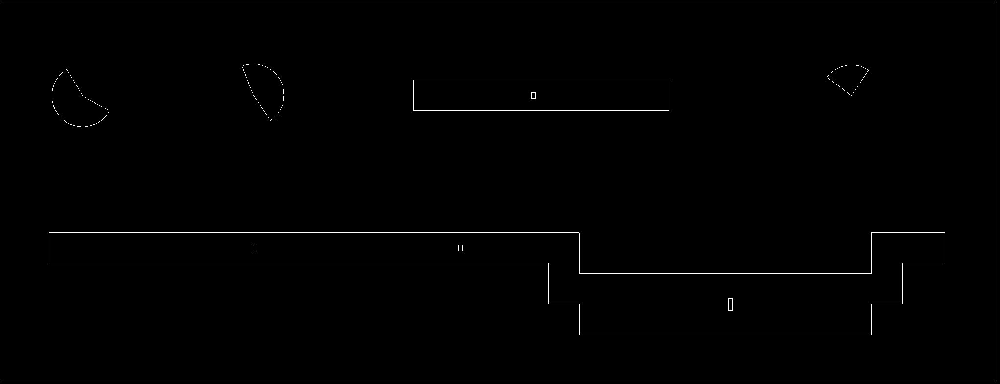
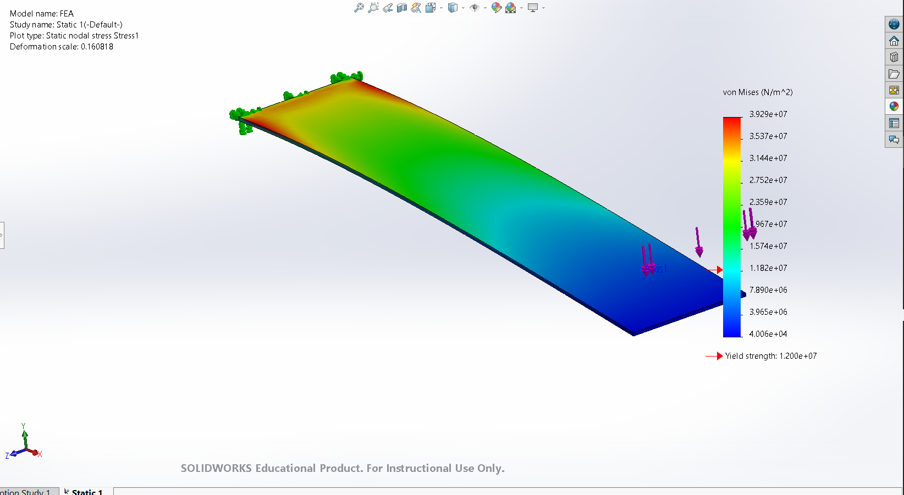

# CAD and Other Design Files

Files (.dxf and .yaml) generated from the [Design and Manufacturing Workflow](https://nbviewer.jupyter.org/url/arnoldjames98.github.io/designManufacturing.ipynb) assignment. The .dxf files can be downloaded from a .zip and the .yaml file can be viewed in the browser.

*  [Download .dxf Files](https://github.com/arnoldjames98/arnoldjames98.github.io/blob/main/other/dxf_Files.zip?raw=true)
*  [View .yaml File](https://raw.githubusercontent.com/arnoldjames98/arnoldjames98.github.io/main/manufacturing/singleLegDrawing%20-%20Sheet1_Drawing%20View1.yaml)

An screenshot for one of the .dxf files (final_cut.dxf) can be seen below.

---

CAD files (.sldasm and .sldprt) created for the [Design and Manufacturing Workflow](https://nbviewer.jupyter.org/url/arnoldjames98.github.io/designManufacturing.ipynb) assignment. The assembly files can be downloaded as a .zip that contains all part files linked properly. The part (containing offset surfaces for each separate body) can be downloaded as well.

*  [Download Full Assembly](https://github.com/arnoldjames98/arnoldjames98.github.io/blob/main/other/singleLegAssemb.zip?raw=true)
*  [Download SolidWorks Part](https://github.com/arnoldjames98/arnoldjames98.github.io/blob/main/other/singleLeg.SLDPRT?raw=true)

An animation of the assembly can be seen below.

---

CAD file created for the Solidworks FEA section of the Dynamics II Prep assignment as part of [System Dynamics II](https://nbviewer.jupyter.org/url/arnoldjames98.github.io/systemDynamicsAll.ipynb). The folder than contained all outputs in addition to the part file can be downloaded as a .zip file. The individual SolidWorks part can also be downloaded separately.
* [Download FEA Analysis](https://github.com/arnoldjames98/arnoldjames98.github.io/blob/main/other/FEA.zip?raw=true)
* [Download SolidWorks Part](https://github.com/arnoldjames98/arnoldjames98.github.io/blob/main/other/FEA.SLDPRT?raw=true)

An image of the FEA Analysis and SolidWorks part can be seen below.

