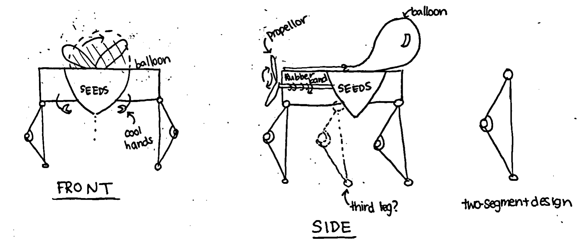

# Home

## Introduction

**Biodegradable Seed Spreading Robot**  
_Team 1: James Arnold, Katie Brauckmann, Cree Hutcherson, and Daniel Stockwell_   
_(e-mails: {jmarnol6, kbrauckm, chutche1, dcstockw}@asu.edu)_

## Research Question

* How can the concepts of foldable robotics be applied to the design of a seed spreading robot that is constructed entirely from biodegradable materials?

## Site Map

[Team Assignment 1: Research Question](/assignment1)   
[Team Assignment 2: Biomechanics](/assignment2)  
[Team Assignment 3: Kinematics](https://nbviewer.jupyter.org/url/arnoldjames98.github.io/systemKinematics.ipynb)  
[Team Assignment 4: Dynamics I](https://nbviewer.jupyter.org/url/arnoldjames98.github.io/systemDynamics.ipynb)  
[Bibliography](/bibliography)

## External Links

[All work is based on the assignments created by Dr. Daniel Aukes](https://egr557.github.io/)
