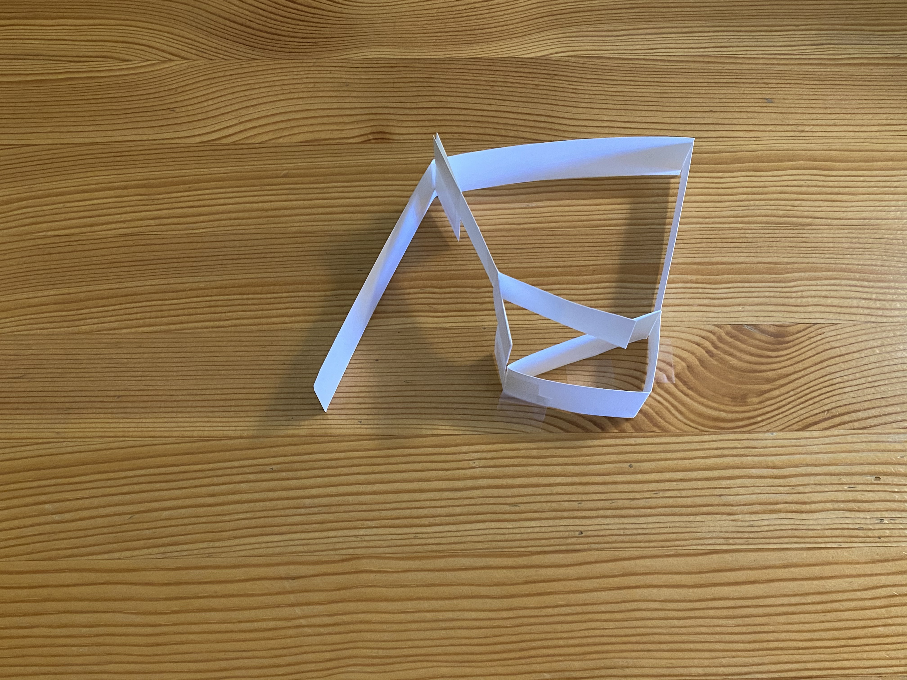

# Video and Image Gallery

Note: Many of the videos and images for this project have been included within the assignment pages. The purpose of this page is not to show all videos and images, only those that were not included as part of other assignments.
   

A video recordered for the [Dynamics](https://nbviewer.jupyter.org/url/arnoldjames98.github.io/systemDynamicsAll.ipynb) assignment. This video was used for characterizing the damping of the cardboard material.
<iframe width="560" height="315" src="https://www.youtube.com/embed/d1bHW5DcUlE" frameborder="0" allow="accelerometer; autoplay; clipboard-write; encrypted-media; gyroscope; picture-in-picture" allowfullscreen></iframe>

---

An image of the manufacturing plan that was developed when creating the prototype used to understand where to model joints as compliant, foldable hinges for the [Dynamics](https://nbviewer.jupyter.org/url/arnoldjames98.github.io/systemDynamicsAll.ipynb) assignment.

---

A video of all the experimental runs from the [Experimental Validation](https://nbviewer.jupyter.org/url/arnoldjames98.github.io/dataCollection.ipynb) assignment. The best run for each condition (in terms of how well the plate stayed on the rollers and how closely the video stayed within the 10 second time limit) was used and included in the assignment.
<iframe width="560" height="315" src="https://www.youtube.com/embed/yYm5BFoyL08" frameborder="0" allow="accelerometer; autoplay; clipboard-write; encrypted-media; gyroscope; picture-in-picture" allowfullscreen></iframe>

---

A collection of images of the experimental set-up from the [Experimental Validation](https://nbviewer.jupyter.org/url/arnoldjames98.github.io/dataCollection.ipynb) assignment from different angles than those included on the assignment page.

---

An image of the first iteration of the foldable Klann linkage mechanism.

---

A collection of images of the stiffness experiment performed as an individual assignment (by Cree) for the [Dynamics](https://nbviewer.jupyter.org/url/arnoldjames98.github.io/systemDynamicsAll.ipynb) assignment from different angles than those included on the assignment page.

